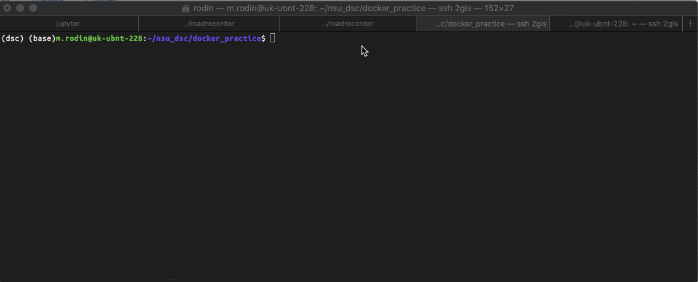

This simple application receives message and push it in redis queue (actually list). When message pushed a worker get it from the redis and write to a database. You can get last N messages from the db using /last method of the api.

Command to run the application:
**docker-compose up**

